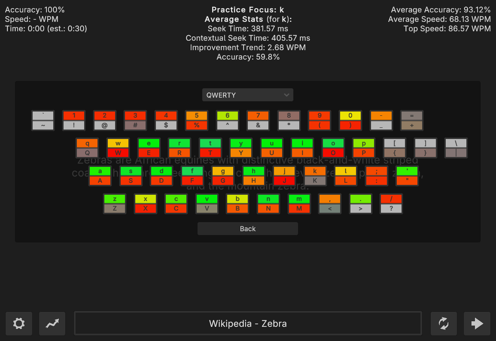
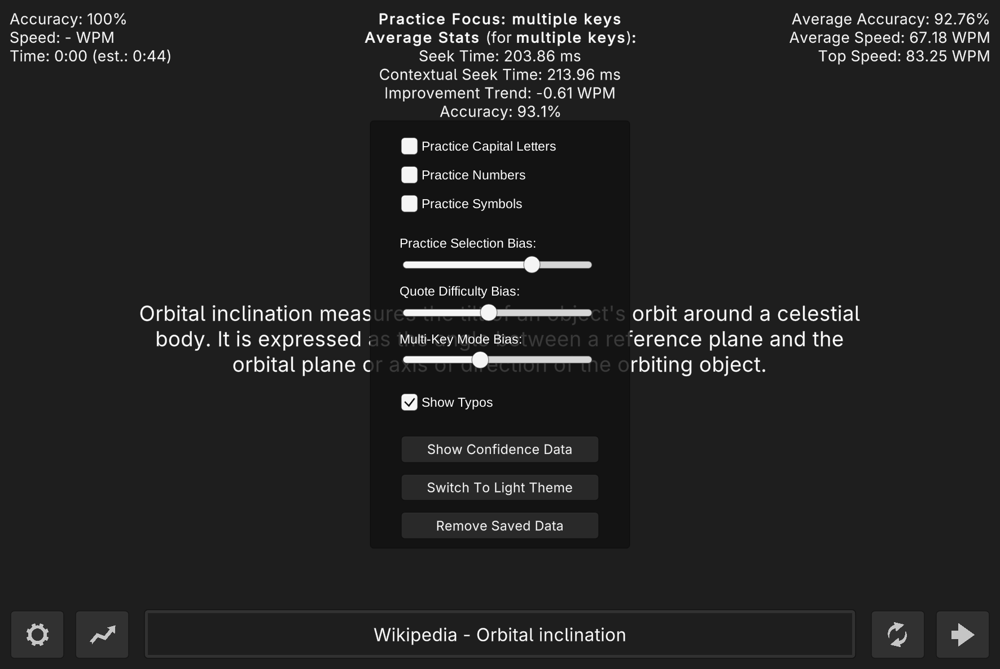

<h1>

  
   Available on <a href="https://no-name-soft.itch.io/keyflow">itch.io</a>
</h1>
  

    Keyflow is a typing practice program which identifies your flaws and helps you resolve them.
  

# Practice and selection

The program measures your typing skill as you type (more on this below), and uses this information
to help promote improvement and consistency in your typing. Keyflow chooses the practice and text
by prioritizing letter frequencies of keys with lowest skill and highest improvement.

Practice consists of typing the text which appears on the screen, and correcting any mistakes using
the backspace key. Mistakes will appear in red, and must be corrected in order to continue.
A practice is finished once all of the text has been correctly typed out.

If a topic piques your interest, click the title at the bottom to open the relevant page on Wikipedia.

> [!NOTE]
> Disclaimer: All quotes were manually obtained from Wikipedia. Text containing phonetic characters
> has been omitted. Information may be outdated, and as such, may differ from the current version on
> Wikipedia.

Typing skill is determined by:

- Average time spent between key-presses for each letter/character (shown as _Seek Time_)
- Average time spent on letters/characters adjacent to each tracked letter/character in the text (shown as _Contextual Seek Time_)
- Average improvement trend for each letter/character, based on the values listed above as they change over time (shown as _Improvement Trend_)
- Average accuracy based on correct and incorrect key-presses (shown as _Accuracy_)
- Average speed (words-per-minute) for all letters/characters contained within each typed word (not shown)

The bias sliders in the settings can be used to adjust how strictly these factors should influence
the text and key practice selection. Higher values mean higher difficulty.

Additionally, the program also tracks your overall typing speed and accuracy per each completed
lesson, which are shown in the top right of the interface. These are solely informational, and have
no influence on practice selection.

# Practice review

Upon completing the text, a graph summarizing your performance appears over the text (where X is
time and Y is value), helping you see how you performed over the course of the practice.
Using the graph, you can better understand what slows you down or makes you faster.

- _Seek Time_ - How long it took to press each key. Shown as a faint white line
- _Word Speed_ - How quickly each word was typed out (words-per-minute, measured individually). Shown as green horizontal bars
- _Speed_ - Average words-per-minute over the current practice, shown in the grey filled area
- _Errors_ - Number of errors that were made at a particular point in the test. Shown as red X-es, only appears when one or more errors are made

To use the graph effectively, look for high peaks in the white line and low green bars, then
hover your mouse cursor over them to see which parts of the text were slowing you down. The
current word will be shown, and the letter at the time in the graph will be highlighted in
bold, so you can see which words and letters took the most time.

# Key confidence map

A visual representation of stored confidence data can be accessed via settings. The key
confidence map displays an on-screen keyboard, where each letter is colored based on your typing
confidence (skill) for that particular key. The keys which tend to slow you down will be colored
orange or red, while the keys with high confidence will appear green.

Confidence is calculated per each key using the seek time and contextual seek time, and the
deviations from the average of all lowercase letter keys. Uppercase letters, numbers, and symbols
are ignored while calculating the average, because they are generally less representative of
typing skill, and less important during day-to-day typing.

- _Leaf green_ - Key confidence is above your average
- _Green_ - Key confidence is about equal to your average
- _Yellow_ - Key confidence is slightly below your average
- _Orange or red_ - Key confidence is well below your average
- _Dim colors_ - Limited data available
- _Light grey_ - No data is available for this key

You can click on any letter/character in the map to select a practice and see the confidence data
for that key in more detail (shown in the top-center of the screen).

Custom keyboard layouts are supported, and can can be configured by adding or editing files in
`Keyflow_Data/Keyboard Layouts` on Linux and Windows, or `Keyflow.app/Contents/Keyboard Layouts`
on MacOS.

# Settings

You can access the settings menu at any time by pressing the gear button in the bottom left.

The settings menu includes:

- _Practice Capital Letters_ - Whether capital letter skill should be considered for practice selection
- _Practice Numbers_ - Whether number skill should should be considered for practice selection
- _Practice Symbols_ - Whether symbol skill should should be considered for practice selection
- _Practice Selection Bias_ - How much should 'Practice Focus' be limited to your problematic characters
- _Quote Difficulty Bias_ - How much should quotes be biased to contain your problematic characters
- _Multi-Key Mode Bias_ - How often should practices focus on overall difficulty rather than individual keys
- _Show Typos_ - Whether to insert incorrect characters into the text, or only highlight it in red
- _Show Confidence Data_ - Opens the key confidence map
- _Switch To Light/Dark Theme_ - Switches between the light and dark themes
- _Remove Saved Data_ - Opens a menu where you can remove key data, scores, or both
